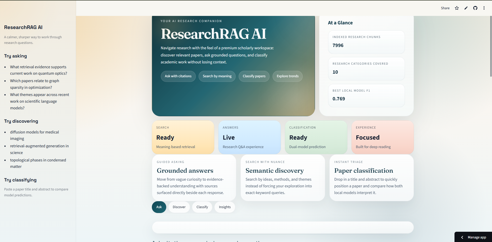
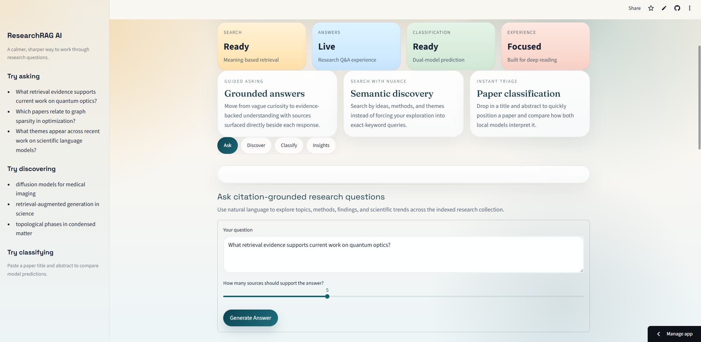

# ResearchRAG AI

ResearchRAG AI is an arXiv-based academic research assistant that combines semantic paper discovery, paper classification, and citation-grounded question answering in a premium Streamlit interface.

## What The App Does

- Ask research questions and receive retrieval-grounded answers with supporting arXiv sources
- Discover papers through semantic search instead of exact keyword matching
- Classify papers from title plus abstract using two trained local models
- Explore model metrics and dataset insights through a dedicated insights section
- Continue working in fallback mode when Gemini is unavailable

## Models And Retrieval Stack

### Classification
- TF-IDF + Logistic Regression
- TF-IDF + MLP Classifier

### Retrieval And Q&A
- Embedding model: `sentence-transformers/all-MiniLM-L6-v2`
- Vector store: FAISS
- Answer generation: Google Gemini API
- Fallback mode: local retrieval-grounded answer synthesis plus local classifiers

## User Experience

The current app is designed as an end-user research workspace rather than a developer dashboard.

Main product sections:
- `Ask`: citation-grounded research Q&A
- `Discover`: semantic paper search
- `Classify`: title + abstract category prediction
- `Insights`: model quality and collection visuals

## Screenshots

### Home Experience



### Ask Workflow



### Semantic Search And Results


### Classification Or Insights View


## Dataset

- Source: arXiv Metadata Snapshot
- Kaggle link: https://www.kaggle.com/datasets/Cornell-University/arxiv

The raw dataset is not committed to GitHub because it is too large. The deployed app uses prebuilt runtime artifacts instead.

## Runtime Artifacts Included In The Repo

These files are included so the Streamlit app can run without the raw dataset:

- `models/faiss_index.bin`
- `models/embedding_metadata.jsonl`
- `models/faiss_index_metadata.json`
- `models/logistic_regression_pipeline.pkl`
- `models/mlp_classifier_pipeline.pkl`
- `models/label_encoder.pkl`
- `reports/eda_exports/*.png`

## Local Setup

```bash
python -m venv .venv
.venv\Scripts\activate
pip install -r requirements-dev.txt
```

## Run The App Locally

```bash
.venv\Scripts\streamlit run app/app.py
```

## Streamlit Community Cloud Deployment

### Entrypoint
- `app/app.py`

### Deployment dependencies
- Use `requirements.txt`

### Streamlit config
- `.streamlit/config.toml` is included for the deployed theme

### Secrets
Add the following in Streamlit Community Cloud secrets:

```toml
GEMINI_API_KEY = "your_key_here"
GEMINI_MODEL = "gemini-2.5-flash"
ARXIV_MAX_RECORDS = "5000"
ARXIV_TOP_CATEGORIES = "10"
```

Notes:
- `GEMINI_API_KEY` is the only sensitive value here
- If Gemini is not configured, the app still works in fallback mode

## Local Development Commands

```bash
.venv\Scripts\python app/arxiv_loader.py
.venv\Scripts\python app/preprocessing.py
.venv\Scripts\python app/embedding_generation.py
.venv\Scripts\python app/vector_store.py
.venv\Scripts\python app/model_training.py
.venv\Scripts\python app/export_eda.py
```

## Reports And Documentation

- `reports/model_metrics.json`
- `reports/model_comparison.csv`
- `reports/EDA_SUMMARY.md`
- `reports/SRS_ALIGNMENT_REVIEW.md`
- `reports/SRS_ONE_PAGE_SUBMISSION.md`
- `notebooks/arxiv_eda.ipynb`

## SRS Alignment

The project includes the required SRS capabilities:

- Streamlit web application
- Paper classification
- Semantic retrieval
- Citation-grounded research Q&A
- Gemini integration
- Offline fallback behavior
- Saved local artifacts for deployment
- Evaluation and EDA outputs
